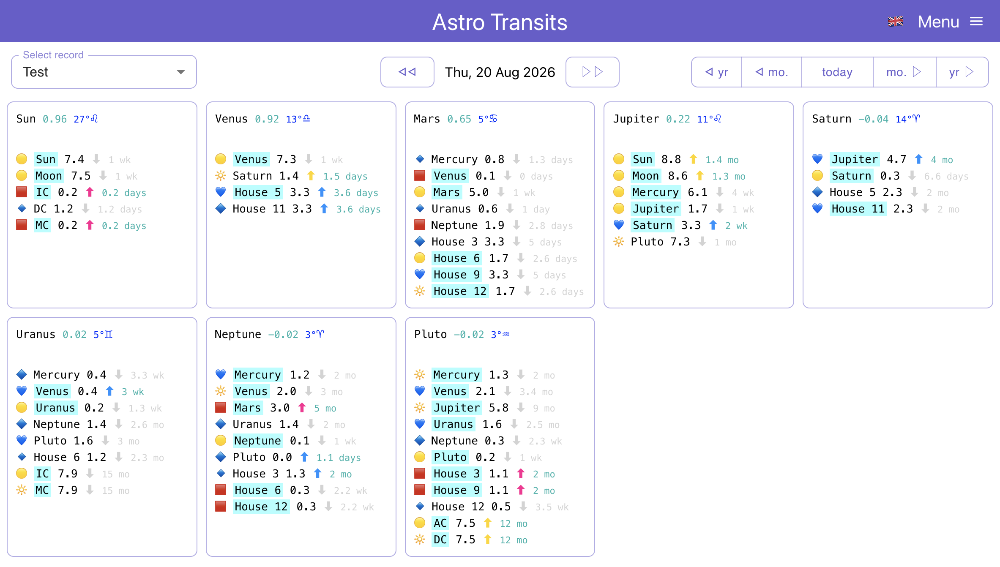

# Astro1

React (Vite + TypeScript) frontend for viewing planetary positions, natal charts, and transit aspects. Consumes the [`ephemerides`](https://github.com/petr-kratochvil/ephemerides) API for astronomical calculations.

**Try it out live: https://astro-transits.vercel.app/**

## Screenshots

[Desktop](doc/screen-desktop.png), [Mobile](doc/screen-mobile.jpg)



## Run locally

```bash
npm install
npm run dev
```

App is served at `http://localhost:3600`. Reads the backend URL from `VITE_EPHEMERIDES_API_BASE` (defaults to `http://localhost:3601`).

## Run with Docker

```bash
npm run docker:build
npm run docker:run
```

The app is now available at `http://localhost:3600`.

## Scripts

```bash
npm run build          # production build
npm run preview        # serve the production build locally
npm run tsc            # typecheck (tsc --noEmit)
npm run lint           # eslint
npm run test           # vitest
npm run format         # prettier --write
npm run format:check   # prettier --check
```

## Stack

Vite, React 18, TypeScript, react-router-dom, MUI.

## License

AGPL-3.0-or-later — see [`LICENSE`](LICENSE).

### Icons license

- License: Flaticon License
- Terms: https://www.flaticon.com/legal
- Downloaded as a Free user (attribution required).
- Icon pack created by Rooman12 - Flaticon
- Icon pack link: https://www.flaticon.com/packs/space-and-moon-life-1
